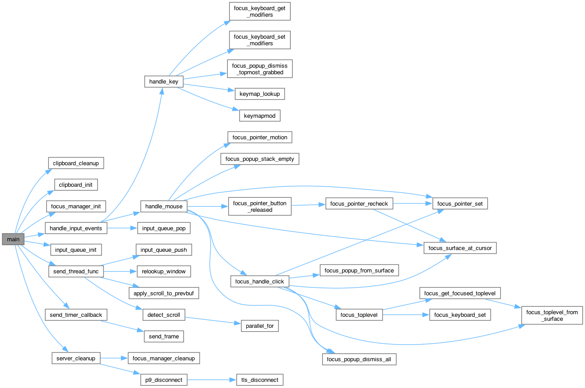

1. `docker build -t p9wl-rdp .`
2. `docker run -itd --security-opt seccomp=unconfined -p 3389:3389 p9wl-rdp`

--- 
```zsh
brew install doxygen graphviz && doxygen -g 

sed -i.bak \
  -e 's/^[# ]*HAVE_DOT[ ]*=.*/HAVE_DOT = YES/' \
  -e 's/^[# ]*CALL_GRAPH[ ]*=.*/CALL_GRAPH = YES/' \
  -e 's/^[# ]*CALLER_GRAPH[ ]*=.*/CALLER_GRAPH = YES/' \
  -e 's|^[# ]*DOT_PATH[ ]*=.*|DOT_PATH = /opt/homebrew/bin|' \
  -e 's/^[# ]*INPUT[ ]*=.*/INPUT = ./' \
  -e 's/^[# ]*RECURSIVE[ ]*=.*/RECURSIVE = YES/' \
Doxyfile

doxygen Doxyfile
```

